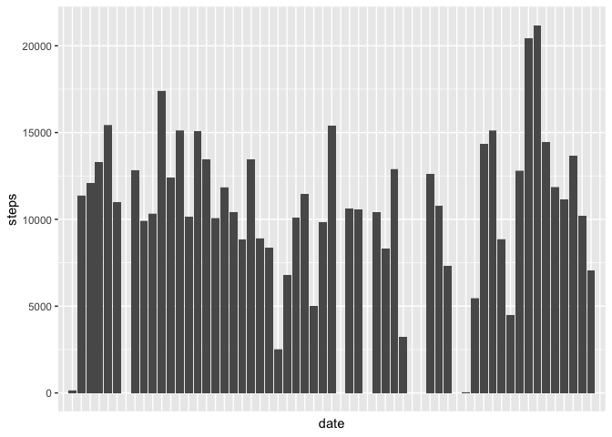
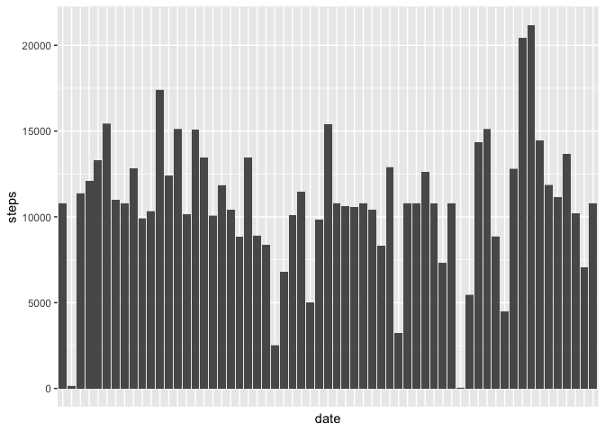
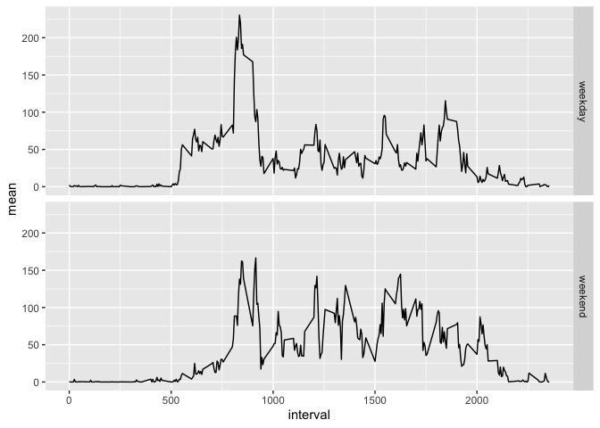

## Loading and preprocessing the data
### 1. Load the data

In order to load the data, first we need to `unzip` the activity zipfile. The data file being in a csv format, we then use the `read.csv` function in order to open it.

```r
unzip("activity.zip")
if (!exists ("activity")){
      activity <- read.csv("activity.csv")
}
head (activity)
```

```
##   steps       date interval
## 1    NA 2012-10-01        0
## 2    NA 2012-10-01        5
## 3    NA 2012-10-01       10
## 4    NA 2012-10-01       15
## 5    NA 2012-10-01       20
## 6    NA 2012-10-01       25
```

### 2. Process/transform the data

We can see here that there are some missing numbers. We may want to remove them and store the result inside a new variable.

```r
activity_noNA <- na.omit (activity)
head (activity_noNA)
```

```
##     steps       date interval
## 289     0 2012-10-02        0
## 290     0 2012-10-02        5
## 291     0 2012-10-02       10
## 292     0 2012-10-02       15
## 293     0 2012-10-02       20
## 294     0 2012-10-02       25
```

## What is the mean total number of steps taken per day?
### 1. Make a histogram of the total number of steps taken each day
We can ignore the missing values, so here we are working with `activity`. The histogram is done using the column geom in `ggplot2` and we remove the x labels for more lisibility.

```r
library(ggplot2)
ggplot (activity, aes (date, steps)) + geom_col () +
        theme (axis.text.x = element_blank (),
               axis.ticks.x = element_blank ())
```

<!-- -->

### 2. Calculate and report the mean and median total number of steps taken per day
We are interested in the mean and median of the sum of the daily steps. First, we need to compute that sum (from the non missing value data). By using the `dplyr` package, we group the data based on the day and compute the sum of the steps for each day into a new data frame: `stat_step_day`.

```r
library(dplyr)

stat_step_day <- as.data.frame (summarize (group_by (activity_noNA, date),
                                           sum = sum(steps)))

head (stat_step_day)
```

```
##         date   sum
## 1 2012-10-02   126
## 2 2012-10-03 11352
## 3 2012-10-04 12116
## 4 2012-10-05 13294
## 5 2012-10-06 15420
## 6 2012-10-07 11015
```
Then we compute the mean and median for the sum of steps.

```r
mean (stat_step_day$sum)
```

```
## [1] 10766.19
```

```r
median (stat_step_day$sum)
```

```
## [1] 10765
```
## What is the average daily activity pattern?

### 1. Make a time series plot of the 5-minute interval and the average number of steps taken, averaged across all days
Once again we are working with the `NA` filtered data. Only this time, we want to group the data according to the interval of the day. So we create a new variable `stat_step_int` that is computed just like the one in the previous question except that this time we group the data according to the interval instead of the day in order to compute the mean of steps (and not the sum).


```r
stat_step_int <- as.data.frame (summarize (group_by (activity_noNA, interval),
                                           mean = mean (steps)))

head (stat_step_int)
```

```
##   interval      mean
## 1        0 1.7169811
## 2        5 0.3396226
## 3       10 0.1320755
## 4       15 0.1509434
## 5       20 0.0754717
## 6       25 2.0943396
```

```r
ggplot (stat_step_int, aes(interval, mean)) + geom_line ()
```

<!-- -->

### 2. Which 5-minute interval, on average across all the days in the dataset, contains the maximum number of steps?

To answer that question, we use the `which.max` function that allows us to retrieve the position of the maximum value in the `mean` column of the `stat_step_int` dataframe, and apply it to the `interval` column in order to get the value of the interval that generates on average the maximum number of steps.

```r
max_int <- stat_step_int$interval [which.max (stat_step_int$mean)]
max_int
```

```
## [1] 835
```

The 835^th^ interval is the one with maximum number of steps on average. It seems to be consistent with the previous graph we made.

## Imputing missing values

### 1. Calculate and report the total number of missing values in the dataset
We apply for every line of `activity` a function that gives a logical answer of whether or not there are NA values in that line (although we could directly work only with the `step` column since it is the only one with missing values). Then we just need to sum up the logical vector we obtained to know how many rows contain NA values.


```r
na_rows <- sum (apply (activity, 1, function(x) {any (is.na (x))} ))
na_rows
```

```
## [1] 2304
```

There are 2304 missing values in the original dataset.

### 2. Devise a strategy for filling in all of the missing values in the dataset

The missing values are missing for the entirety of one day. It makes more sense to replace these days by the average step values by intervals that we already computed in `stat_step_int`.


### 3. Create a new dataset that is equal to the original dataset but with the missing data filled in

We create a new variable `activity_full` based on `activity` where we fill these missing values.


```r
activity_full <- activity ## we start from the data in activity

## we want to replace the missing values in the 'steps' column of activity_full
## with the corresponding value that we find in stat_step_int, according to the
## 'interval' number (n in the function description of the code below).

activity_full$steps [ is.na (activity$steps) ] <- 
      sapply ( activity$interval [ is.na (activity$steps) ],
              function(n) { stat_step_int$mean [stat_step_int$interval == n] })
```

### 4. Make a histogram of the total number of steps taken each day and calculate and report the mean and median total number of steps taken per day.


```r
ggplot (activity_full, aes (date, steps)) + geom_col () +
      theme (axis.text.x = element_blank (),
             axis.ticks.x = element_blank ())
```

<!-- -->

We can see that this histogram is very similar to the first one we made but doesn't have missing columns anymore.

Now to calculate the mean and median, we just repeat what we did in the second section but this time we use `activity_full` instead of `activity_noNA`.


```r
stat_step_day_full <- as.data.frame (summarize (group_by (activity_full, date),
                                                sum=sum(steps)))

head (stat_step_day_full)
```

```
##         date      sum
## 1 2012-10-01 10766.19
## 2 2012-10-02   126.00
## 3 2012-10-03 11352.00
## 4 2012-10-04 12116.00
## 5 2012-10-05 13294.00
## 6 2012-10-06 15420.00
```

```r
mean (stat_step_day_full$sum)
```

```
## [1] 10766.19
```

```r
median (stat_step_day_full$sum)
```

```
## [1] 10766.19
```

Although the mean remains the same, the median slightly changed (and became equal to the mean). Imputing missing data like this can change the statistical distribution of the data and decrease the variance of the output.

## Are there differences in activity patterns between weekdays and weekends?

### 1. Create a new factor variable in the dataset with two levels -- "weekday" and "weekend" indicating whether a given date is a weekday or weekend day.

First we add a new column to the `activity_full` dataframe which is by default equal to `"weekday"`.


```r
library(lubridate)
Sys.setlocale("LC_TIME","C")
```

```
## [1] "C"
```

```r
# this is in order to get weekdays in english for those whose settings
# are set in another language like me.
```

```r
activity_full <- mutate (activity_full, day="weekday")
```

Now we change it for the days that are saturdays or sundays into `"weekend"`.

```r
activity_full$day [weekdays (ymd (activity_full$date)) %in%
                          c ("Saturday","Sunday")] = "weekend"
```

### 2. Make a panel plot containing a time series plot of the 5-minute interval and the average number of steps taken, averaged across all weekday days or weekend days.

Like in section 3, we create an intermediate variable `stat_final` that computes the mean of steps according to the interval value and day type. This time, we use the `activity_full` data as a starting point and we also group the result according to the day (weekday or weekend).


```r
stat_final <- as.data.frame (summarize (group_by (activity_full, interval, day),
                                      mean = mean (steps)))

ggplot (stat_final, aes (interval, mean)) + facet_grid (day~.) + geom_line ()
```

<!-- -->


